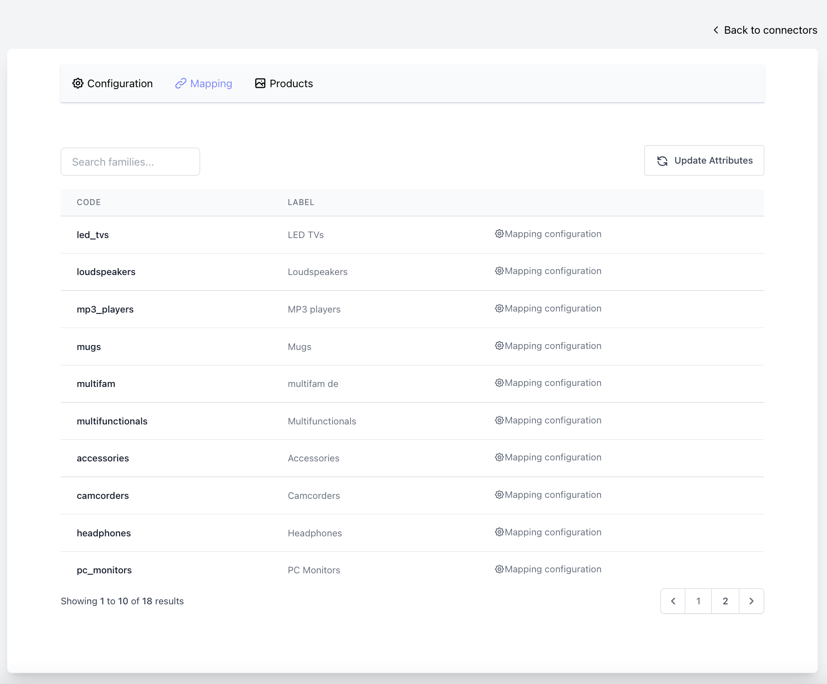

# Filerobot Akeneo CE Connector by Scaleflex
## Prerequisites
- Create Filerobot Account [Here](https://www.scaleflex.com/request-a-demo)

## Requirement
Application use Laravel 9 and Livewire
* PHP Version 8.1 and above
* Redis
* PostgresSQL
* For sending Mail, You can create account from Mailgun, Postmarkapp or
any services you want.

## Installation
* Change .env.example to .env
```
#Update DB Connection
DB_CONNECTION=pgsql
DB_HOST=127.0.0.1
DB_PORT=5432
DB_DATABASE=filekeneo
DB_USERNAME=postgres
DB_PASSWORD=postgres

#Change Queue Connection
REDIS_CLIENT=predis
REDIS_HOST=127.0.0.1
REDIS_PASSWORD=null
REDIS_PORT=6379

#Update Mail setting, If you want to send mail
```
* Install packages & Migrate database
```shell
composer install
php artisan migrate
```
* For Application Deployment you can Check this [Document](https://laravel.com/docs/9.x/deployment)
* Application use Horizon to manage Queue, you can use this [Installation Guide](https://laravel.com/docs/9.x/horizon#deploying-horizon)

## User guide
### 1. Setup
* Open application on browser and go to ```https://yourdomain/register``` to create an account
  
* Then login to the system by go to this link ```https://yourdomain/login```
  
* Create new connector by Click ```Add Connector``` and choose your version
  
* Fill all information
  
* After submit please wait until ```Setup status``` change from ```Pending``` or ```Processing```
to ```Successfull```
  

### 2. Config Mapping
* After finished setup process, please go to mapping, choose which mapping family you want 
to config
  
