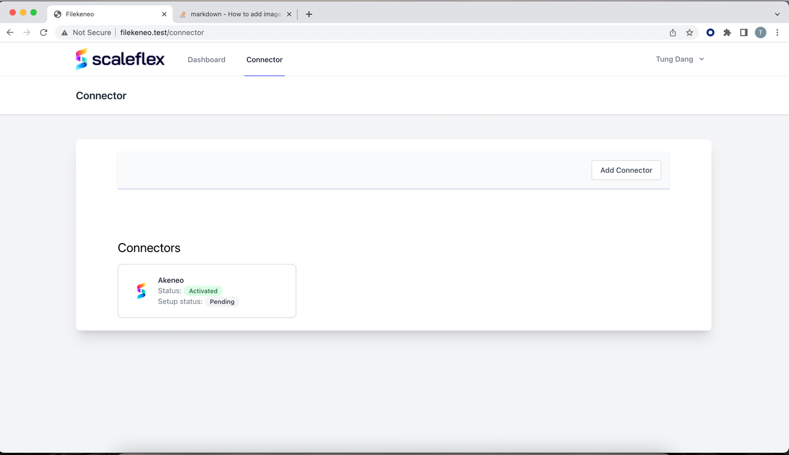

# Filerobot Akeneo CE Connector by Scaleflex
## Prerequisites
- Create Filerobot Account [Here](https://www.scaleflex.com/request-a-demo)

## Requirement
Application use Laravel 9 and Livewire
* PHP Version 8.1 and above
* Redis
* PostgresSQL
* For sending Mail, You can create account from Mailgun, Postmarkapp or
any services you want.

## Installation
* Change .env.example to .env
```
#Update DB Connection
DB_CONNECTION=pgsql
DB_HOST=127.0.0.1
DB_PORT=5432
DB_DATABASE=filekeneo
DB_USERNAME=postgres
DB_PASSWORD=postgres

#Change Queue Connection
REDIS_CLIENT=predis
REDIS_HOST=127.0.0.1
REDIS_PASSWORD=null
REDIS_PORT=6379

#Update Mail setting, If you want to send mail
```
* Install packages & Migrate database
```shell
composer install
php artisan migrate
```
* For Application Deployment you can Check this [Document](https://laravel.com/docs/9.x/deployment)
* Application use Horizon to manage Queue, you can use this [Installation Guide](https://laravel.com/docs/9.x/horizon#deploying-horizon)
* Cronjob setting
```shell
* * * * * cd /path-to-your-project && php artisan schedule:run >> /dev/null 2>&1
```

## User guide
### 1. Setup
* Open application on browser and go to ```https://yourdomain/register``` to create an account
  
* Then login to the system by go to this link ```https://yourdomain/login```
  
* Create new connector by Click ```Add Connector``` and choose your version
  
* Fill all information
  
* After submit please wait until ```Setup status``` change from ```Pending``` or ```Processing```
to ```Successfull```
  

### 2. Config Mapping
* After finished setup process, please go to mapping, choose which mapping family you want 
to config
  
* There are two settings

Type Global: Mapping for image without scope and locale specific
   
  - Position = Filerobot Product position
  - Akeneo Attribute 
  - Behavior: Override(If any update -> override old file in Akeneo), Ask(If new verion -> Ask for action), Keep old version(Do not update if there is new version)

Type Scope and Locale:
  
  - Position: Filerobot position
  - Name: Name of tag or variant
  - Type: Tag or Variant
  - Scope: Akeneo Scope(Channel)
  - Locale: Akeneo Locale(Change depend on Scope), If Scope is Null -> All available locales
  - Attribute: Akeneo Attribute, Attribute (will change depend on its config(Value per channel, Value per locale)):
  
  - Behavior: Same as Global type

### 3. Image Product in Filerobot

- Product reference: Product or Product Model SKU in Akeneo
- Position: Position in Connector(Use to mapping with Akeneo Attribute)

If you have difference images per Channel or Locale you can use tags and variants
- Difference image per channel or locale: Use Tag
- Difference image size: Use Variant

Name of tags and variant is very important, you want to use it to make mapping with akeneo attribute
Tag


Variant


### 4. Review Assets Sync
You can review assets sync or not to Akeneo by to to Tab ```Products```, you can choose the way asset view
- Product view
  

- Asset view
  

You can
- Search and View Assets by product Code
- Check why asset sync failed
- Check if new version, and change new version sync behavior
- Filter Support
  - By Action: Pending, Override, Keep Old
  - By Status: Sync successful, Sync failed, Not synced yet
  - By Type: Global, Tag, Variant, Null(Special case)
  - Go to configuration for family of product

## Warning
- If there are any change on Akeneo, You could go to config and Click ```Submit``` to sync new update from akeneo 
to System

